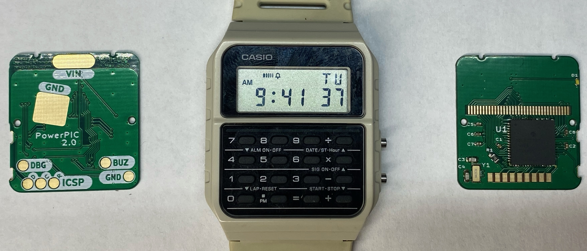

# PowerPIC Calculator Watch
The PowerPIC is a replacement board for Casio CA-53W Databank watches with
upgraded hardware and customizable firmware. The project was designed with
the intent for a personal watch, but all of the needed design files and
firmware is available for free so anyone can make their own (if you can get
the PICs!).

## Features
- Full control of all 82 segments on the original display.
- Interrupt enabled keypad and buttons.
- Variable frequency piezo buzzer.
- Single color LED backlight.
- Built in temperature sensor.
- 12-bit ADC for sensing battery charge.

## Documentation
**Firmware:** The current state of the firmware is heavily evolving, so
the best source of documentation is the code itself, located in the `firmware/`
directory. A Doxyfile is provided, however the generated documentation should
be considered incorrect and outdated.

**Hardware:** Design files and schematics are available in the `hardware/`
directory.

## Credits
Thanks to Travis and Joey, I obtained a lot of inspiration from their projects:
- [GoodWatch](https://github.com/travisgoodspeed/goodwatch) --
Another CA-53W replacement board based on TI's MSP430.
- [Sensor Watch](https://github.com/joeycastillo/Sensor-Watch) --
A replacement board for the classic Casio F-91W based on Microchip's ATSAML22.
